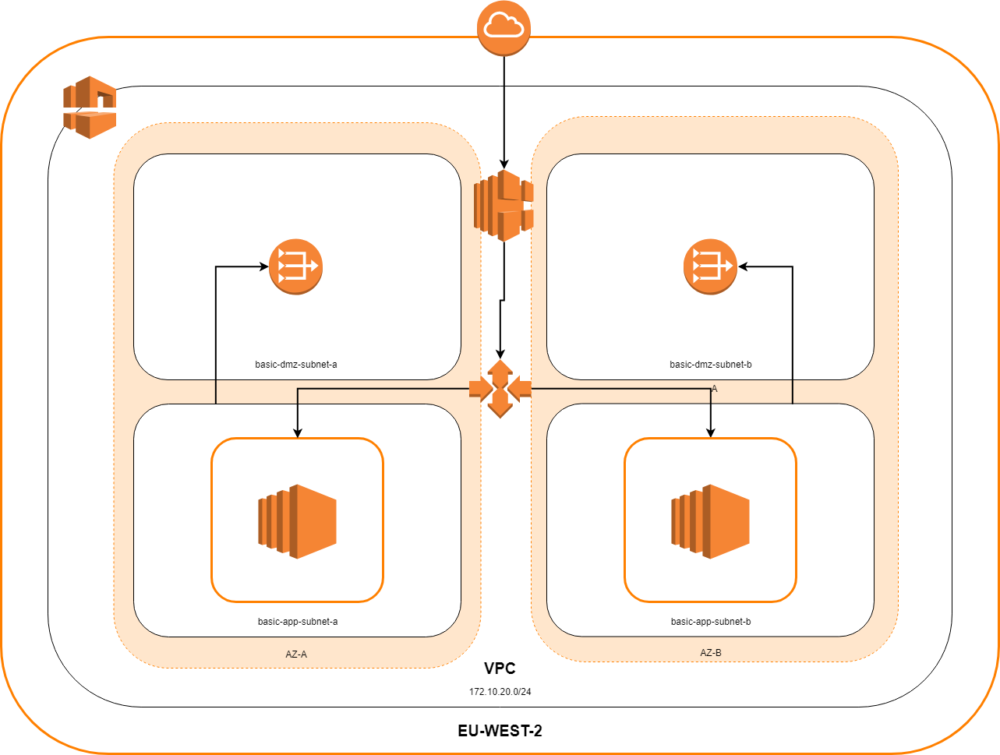

# checkout-web-app

## Deploying the web-service

* Clone this repo from git https://github.com/AtilaSuleyman/checkout-web-app.git
* Change your directory so that you are in the root of checkout-web-app
* terraform init
* terraform apply (gives you the opportunity to see what will be applied before doing it)

## Scaling for a Larger Audience

My implementation provides a public facing load balancer and an autoscaling group. This allows for incoming traffic to be 
distributed amongst all instances that the auto scaling group brings up; This ensures even spread of traffic. 
 
I have also made sure that the autoscaling group is able to spin up instances in different AZs in order to maintain 
high-availability of the service. This ensures that if a whole availability zone goes down, your service will still be operational. 

The autoscaling group uses a policy that helps it scale up instances horizontally and dynamically based on how much CPU is 
being utilized. This ensures that if instances are doing a lot of work, for example we have a spike in consumers using 
services; more will be made to help distributed the load.

## Network Diagram

  
